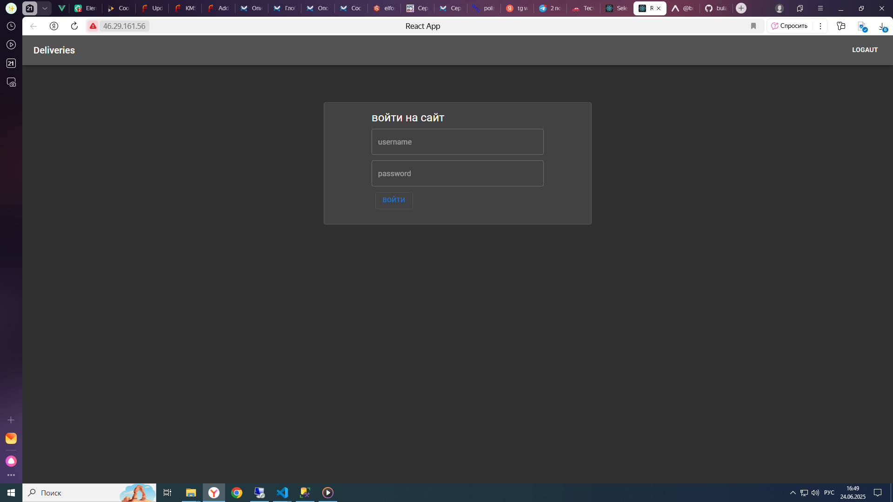
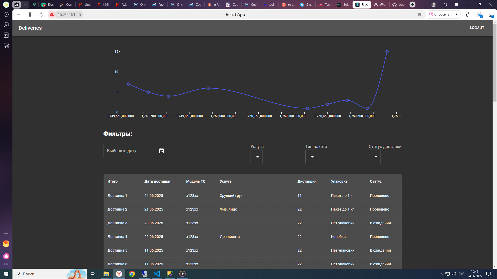
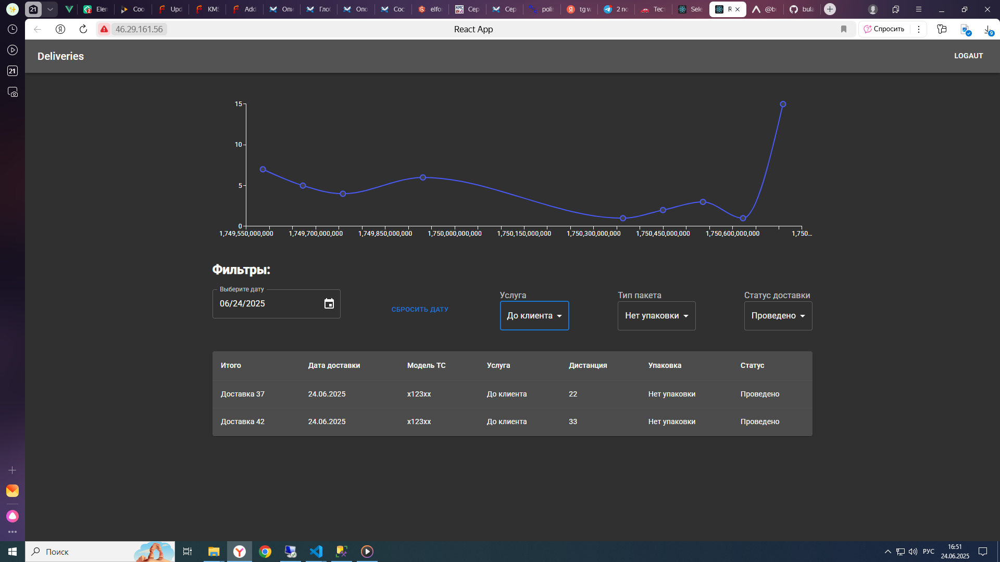
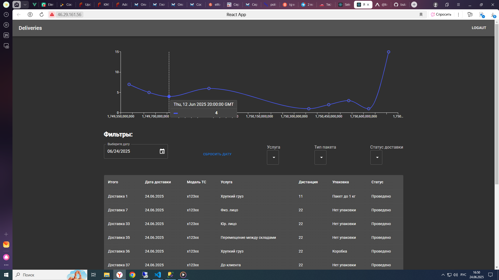
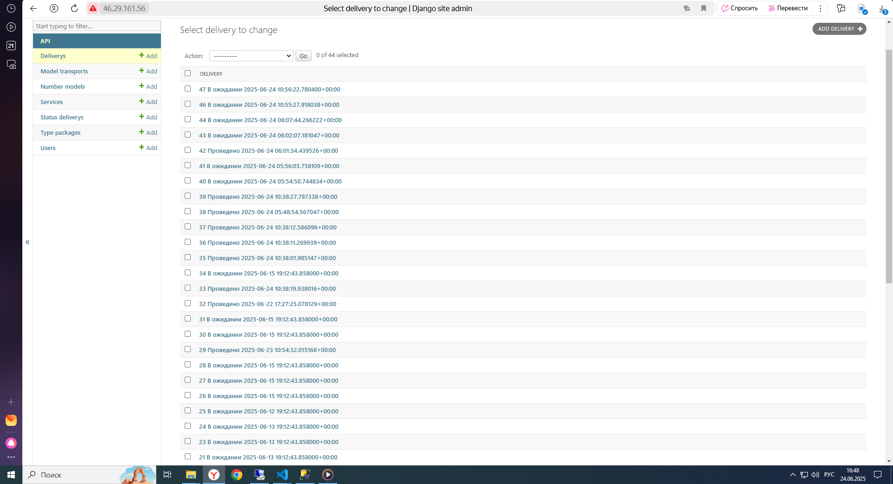
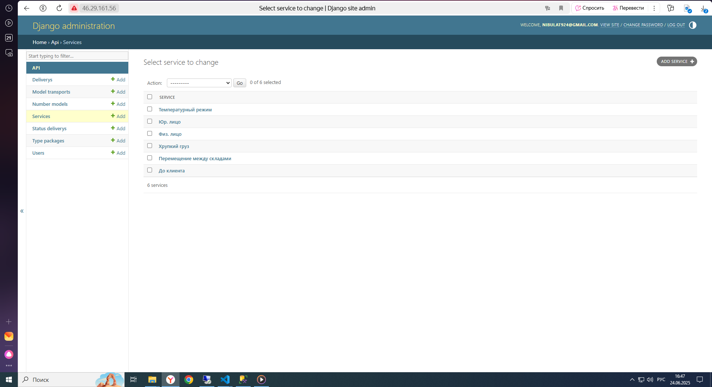
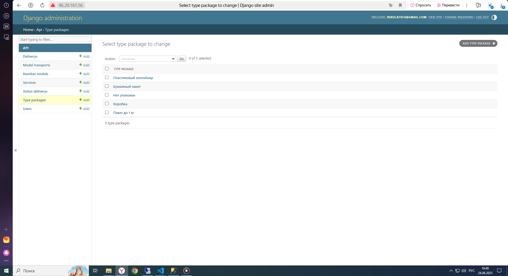
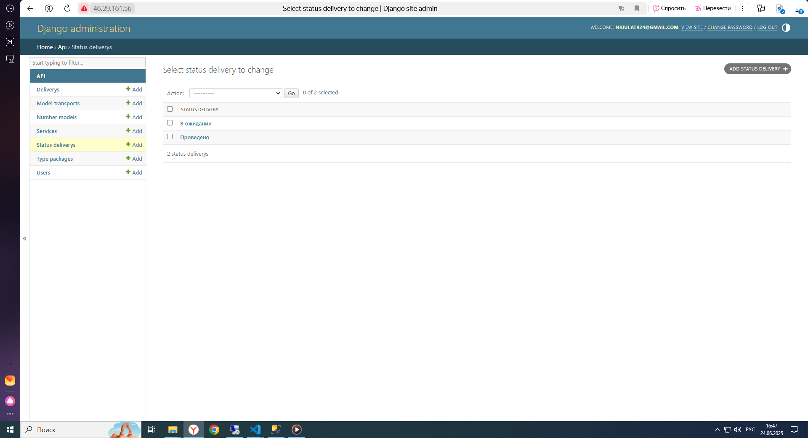
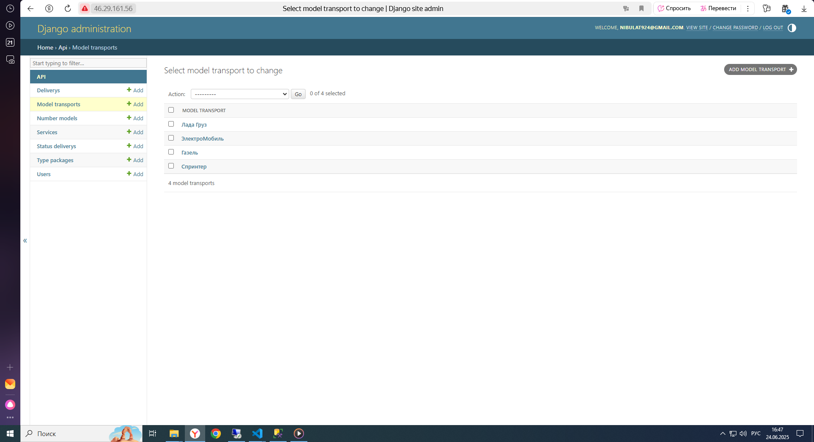
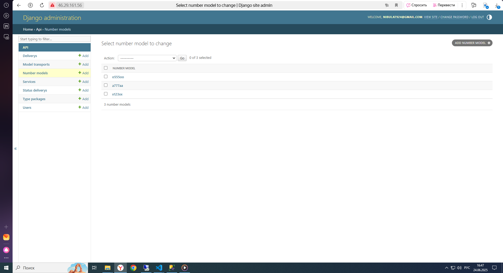

# Delivery task


## Getting Started <a name = "getting_started"></a>

 

```
git clone https://github.com/bulat-nitaliev/delivery_drf_react.git
cd delivery_drf_react
```
Добавить файлы .env по примеру 
в файле nginx/nginx.conf заменить 
server_name  46.29.161.56; -> server_name  localhost;


### Installing


```
sudo docker compose build
sudo docker compose up
```

необходимо создать суперпользователя 
```
sudo docker compose exec -it  server sh
python manage.py createsuperuser
```

перейти по адресу http://localhost для веб-приложения авторизация логин и пароль как у созданного пользователя
перейти по адресу http://localhost/admin для Django Admin












